# DrunkBuddy

A peer-to-peer safety platform that gets severely intoxicated people home safely by enabling strangers to scan a wearable QR code and automatically dispatch a pre-authorized rideshare.

## The Problem

When someone becomes too drunk to use their phone, navigate a rideshare app, or remember their home address, they face bad options: get left on the street, call 911 for a non-emergency, burden a sober friend all night, or hope a stranger helps them.

## The Solution

DrunkBuddy creates a two-sided marketplace where:
- **Incapacitated users** wear a wearable QR code (tattoo, card, wristband) encoded with their home address and pre-authorized payment
- **Good Samaritans ("Buddies")** scan the code with their phone → the backend automatically orders an Uber to the user's home
- **Buddies earn** $20 cash + Karma points for scanning and waiting with the user
- **Drivers earn** $390 total payout ($100 time-loss + $280 hazard cleaning guarantee) + a biohazard kit, making hazard-risk fares profitable
- **Venues** market themselves as "Safe-Hammered" certified locations, earning commissions on staff scans
- **Friends** can pre-notify each other on nights out and intercept before a public Buddy scans

## Key Features

### Driver Adoption (Forcing Function)
- Instant $390 payout for accepting a DrunkBuddy fare (no claims paperwork)
- Free biohazard kit (plastic sheeting, easy deploy/teardown) distributed at signup
- Additional $300 instant bounty if a biohazard incident is confirmed via photo
- Peak-night incentive: Higher payouts during 1–4 AM Fri/Sat

### Buddy Engagement
- $20 minimum commission per scan (on-ramp to adoption)
- Karma points + leaderboards + badges + crew status (stickiness and network effects)
- "Morning After" social feed for optional user-initiated gratitude
- Designated Guard mechanic: Friends earn Karma + cash for scanning squad members

### User Safety
- Automatic rideshare dispatch without any phone interaction
- Pre-authorized medical escalation: Buddies incentivized to call 911 if user is unresponsive
- Police welfare check notification if driver capacity is at ceiling
- Good Samaritan waiver + pre-authorized payment consent while sober

### Viral Growth
- Referral credits: Sign up N friends → next rescue fee waived
- Squad Sync: Friends pre-notify each other on "Bender Mode" nights, get real-time scan alerts
- Friend-first routing: Friends intercept before public Buddies

### Venue Integration
- "Safe-Hammered" badge: Featured on app map as the safest venue in the city
- Staff commissions: Bouncers/bartenders earn cuts of Buddy commissions for proactive scanning
- Data dashboard: Patron safety metrics, rescue frequency, liability narratives for insurance

## UX Flows

### 1. User Setup & Bender Mode Activation

User configures their profile and activates Bender Mode for a night out.

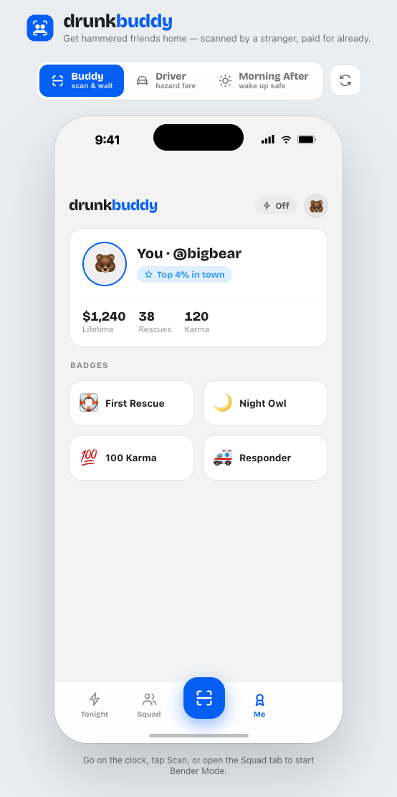
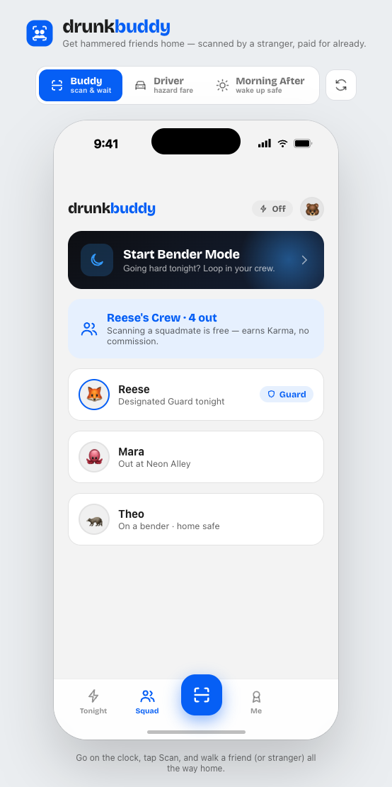
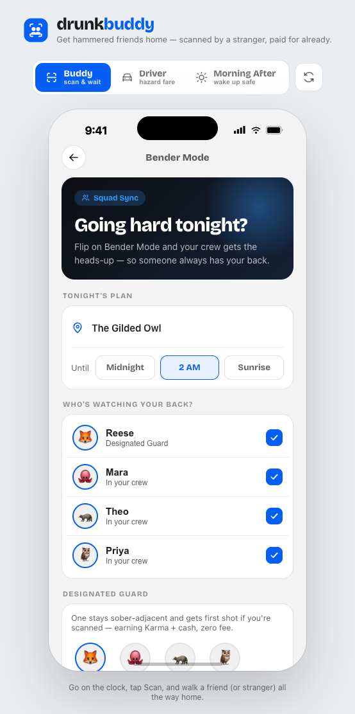
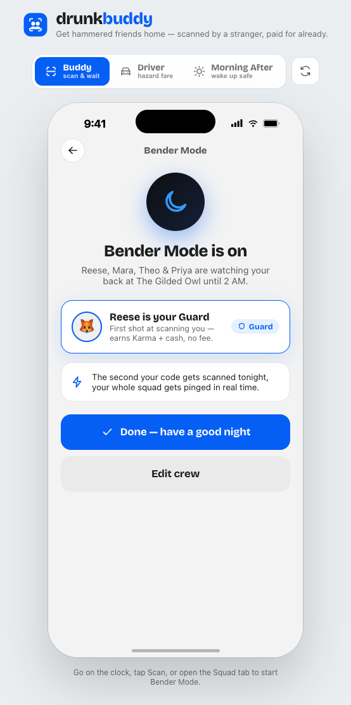

### 2. Buddy Discovery & QR Scanning

Good Samaritan finds the incapacitated person and scans their wearable QR code.

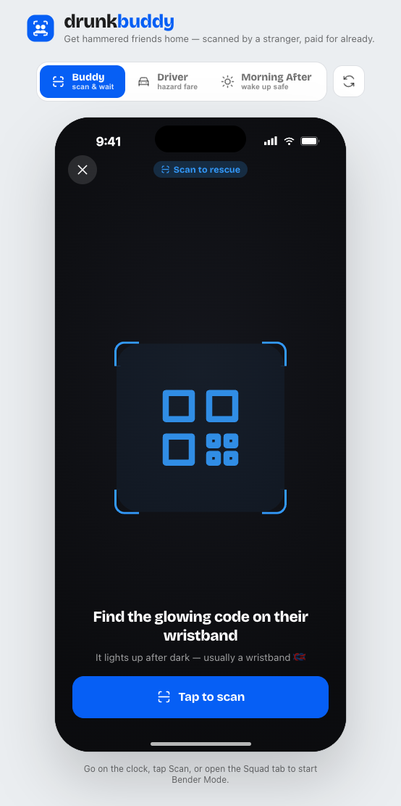
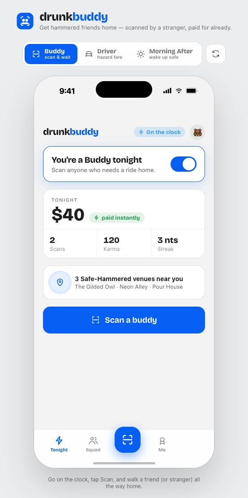
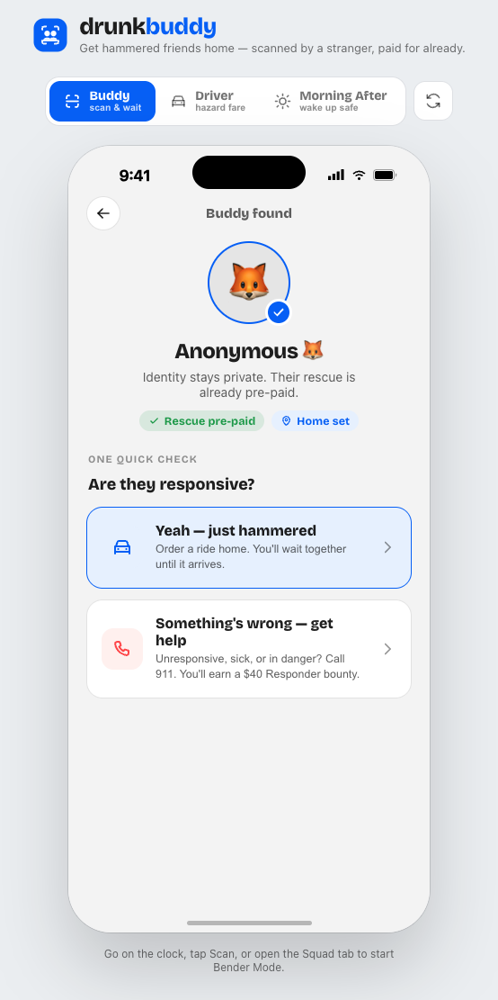

### 3. Waiting for Rideshare

Backend dispatch is initiated. Buddy waits with the user for the driver to arrive.

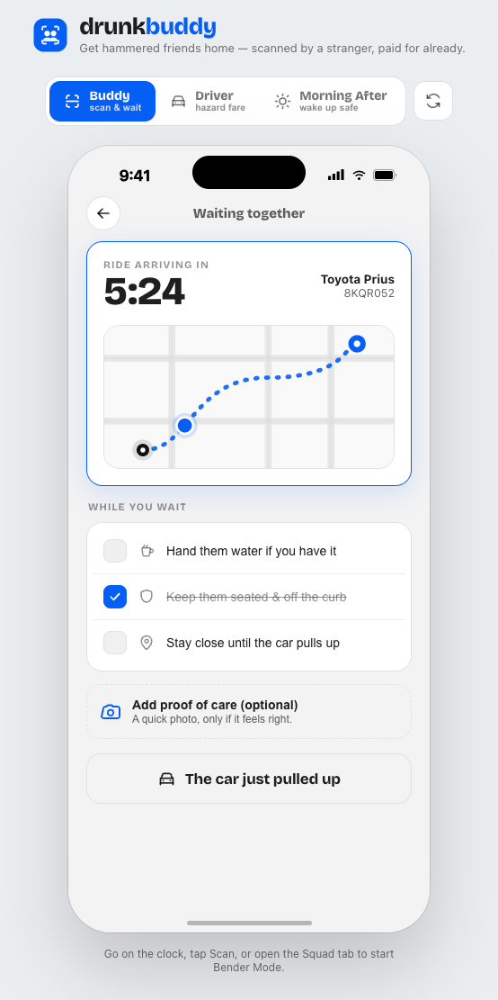

### 4. Driver Acceptance & Route

Driver receives the DrunkBuddy fare notification and accepts it. Driver en route to pickup location.

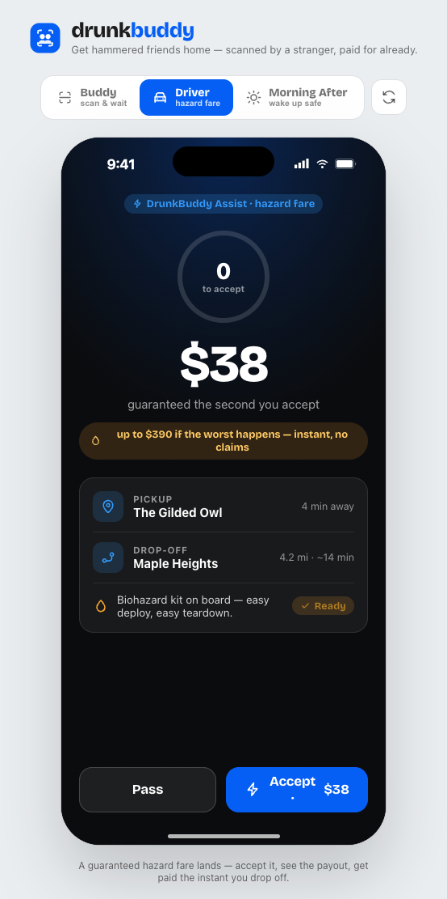
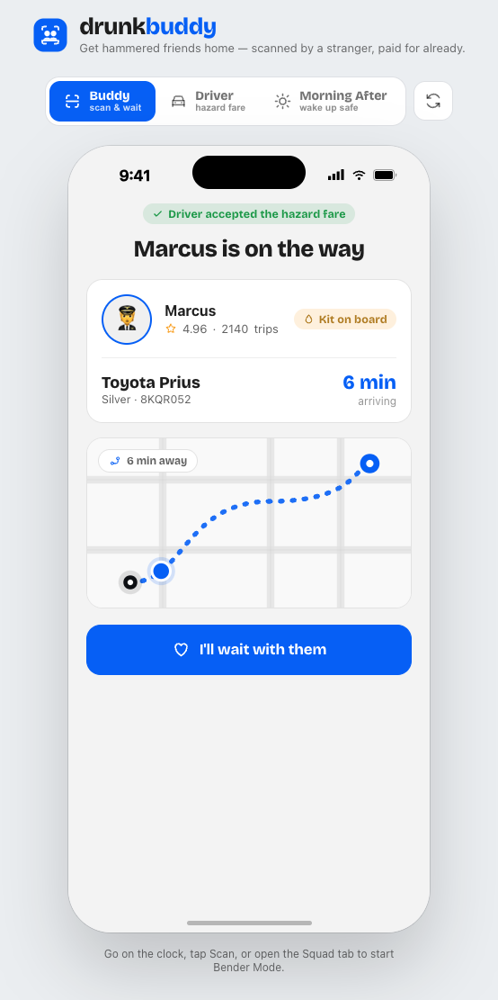

### 5. In Car & Rescue Complete

User is safely in the vehicle. Rescue is confirmed as complete.

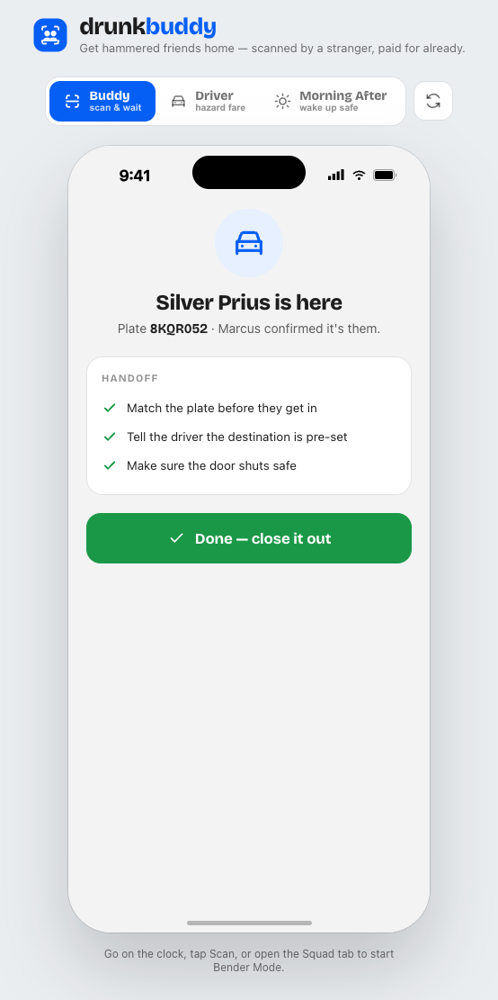
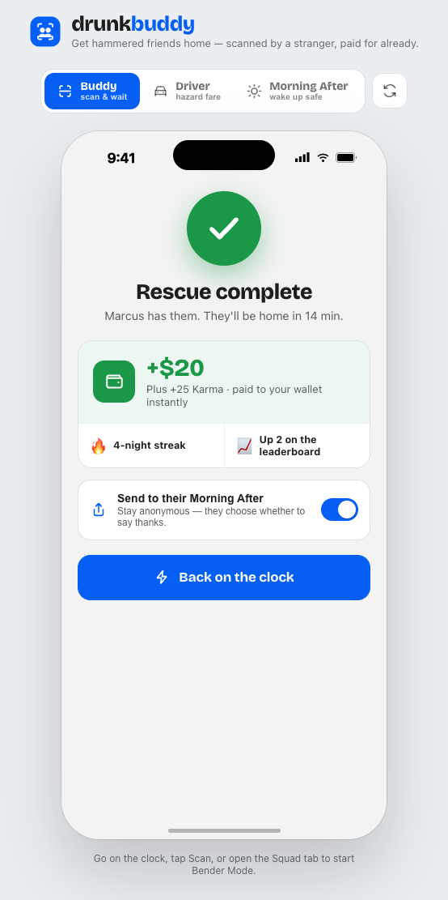

### 6. Morning After Portal

User wakes up sober and reviews their rescue: Proof of Care photo, Buddy details, and can send a thank-you tip.

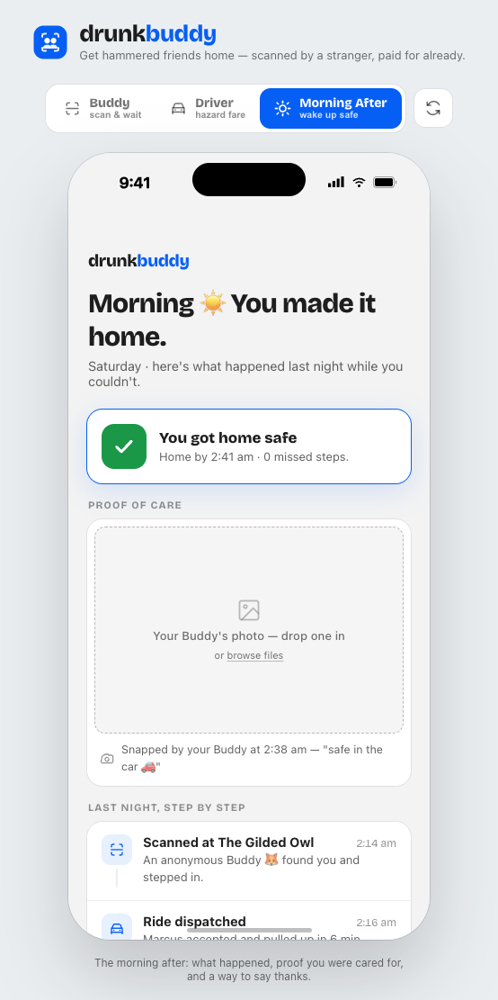

## Product Philosophy

This concept is built on **complementarity, not compromise**:
- **Safety + Economics**: High driver premiums don't cost safety — they enable it by making drivers conscientious
- **Friends + Scale**: Friends are the growth engine, not an alternative to scale
- **Privacy + Engagement**: Anonymity by default, optional user-initiated gratitude
- **Payout + Profitability**: The $390 fee is shared across stakeholders (base fare + time-loss + cleaning + platform rake)

## Project Status

**Phase**: MVP / Interactive Prototype

Currently building clickable prototypes to validate:
- UX flows across all stakeholder types
- Technical feasibility of Rideshare API integration
- Payment pre-authorization and payout mechanics
- Incentive design (cash on-ramp vs. cred stickiness)

## Documentation

- [**concept.md**](./concept.md) — Full product framing: purpose, outcomes, stakeholders, boundary, constraints, tensions, alternatives
- **TODO.md** — Active work tracking (UX design, technical validation, prototype implementation)
